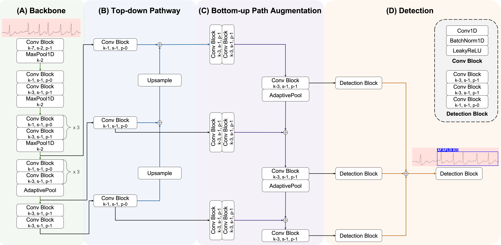
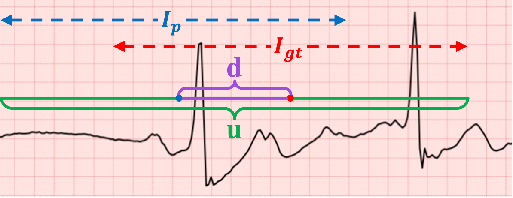
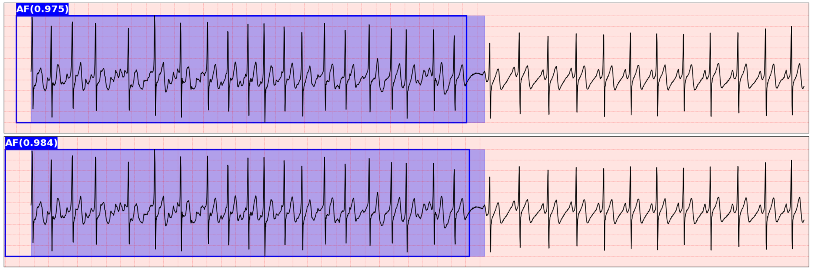

# ALPSE : Arrhythmia Localization using Parameter-efficient deep learning model from Single-lead ECG

**[Model]**
The ALPSE was inspired by YOLO [1], FPN [2], and PANet [3], and was designed to achieve one-step detection with high computational efficiency and model fidelity.
<p align="center">
    
</p>  

**[1D DIoU]**
ECG data necessitates consideration of only the temporal dimension. Therefore, we modified the original DIoU loss [4] to a one-dimensional DIoU loss.
<p align="center">
    
</p>

$u=|I_p\cup I_{gt}|$ (green) is the length of the union of two intervals $I_p$ (blue) and $I_{gt}$ (red). ${d = \rho(c, c_{gt})}$ (purple) is the distance of central points $c$ and $c_{gt}$ of two intervals.

```math
\mathcal{L}_{diou}=1-\Big(\frac{|I_p\cap I_{gt}|}{|I_p\cup I_{gt}|} - \frac{\rho^2 (c, c_{gt})}{|I_p\cup I_{gt}|+\delta}\Big)
```

where, $\rho(·)$ is denoted to the Euclidean distance and $\delta$ is a small value to avoid dividing by zero.


## Datasets
- Long Term AF Database (LTAFDB) [5] : 84 recordings from 84 patients, 128 Hz, 24-25 hours per recording.
  https://physionet.org/content/ltafdb/1.0.0/
- MIT-BIH Atrial Fibrillation Database (AFDB) [6] : 23 recordings from 23 patients, 256 Hz, 10 hours per recording.
  https://physionet.org/content/afdb/1.0.0/
- The 4th China Physiological Signal Challenge 2021 (CPSC2021) [7] : 1,436 recordings from 105 patients, 200 Hz, 20 minutes per recording.
  https://physionet.org/content/cpsc2021/1.0.0/
- MIT-BIH Arrhythmia Database (MITDB) [8] : 48 recordings from 47 patients, 360 Hz, 30 minutes per recording.
  https://www.physionet.org/content/mitdb/1.0.0/
- MIT-BIH Normal Sinus Rhythm Database (NSRDB) [9] : 18 recordings from 18 patients, 128 Hz, over 24 hours per recording.
  https://physionet.org/content/nsrdb/1.0.0/


## Prediction
Examples of prediction in LTAFDB trained with AFDB (top) and trained with CPSC2021 (bottom), respectively. ECG in the blue area is the actual AF/AFL and the blue box with the confidence value is the  AF/AFL predicted by the proposed model.

<p align="center">
    
</p>    


> [1] Redmon, J., Divvala, S., Girshick, R., & Farhadi, A. (2016). You only look once: Unified, real-time object detection. In Proceedings of the IEEE conference on computer vision and pattern recognition (pp. 779-788).

> [2] Lin, T. Y., Dollár, P., Girshick, R., He, K., Hariharan, B., & Belongie, S. (2017). Feature pyramid networks for object detection. In Proceedings of the IEEE conference on computer vision and pattern recognition (pp. 2117-2125).

> [3] Liu, S., Qi, L., Qin, H., Shi, J., & Jia, J. (2018). Path aggregation network for instance segmentation. In Proceedings of the IEEE conference on computer vision and pattern recognition (pp. 8759-8768).

> [4] Zheng, Z., Wang, P., Liu, W., Li, J., Ye, R., & Ren, D. (2020, April). Distance-IoU loss: Faster and better learning for bounding box regression. In Proceedings of the AAAI conference on artificial intelligence (Vol. 34, No. 07, pp. 12993-13000).

> [5] Petrutiu S, Sahakian AV, Swiryn S. Abrupt changes in fibrillatory wave characteristics at the termination of paroxysmal atrial fibrillation in humans. Europace 9:466-470 (2007).

> [6] Moody GB, Mark RG. A new method for detecting atrial fibrillation using R-R intervals. Computers in Cardiology. 10:227-230 (1983).

> [7] Wang, X., Ma, C., Zhang, X., Gao, H., Clifford, G. D., & Liu, C. (2021). Paroxysmal Atrial Fibrillation Events Detection from Dynamic ECG Recordings: The 4th China Physiological Signal Challenge 2021 (version 1.0.0). PhysioNet. https://doi.org/10.13026/ksya-qw89.

> [8] Moody GB, Mark RG. The impact of the MIT-BIH Arrhythmia Database. IEEE Eng in Med and Biol 20(3):45-50 (May-June 2001). (PMID: 11446209)

> [9] Goldberger, A., Amaral, L., Glass, L., Hausdorff, J., Ivanov, P. C., Mark, R., ... & Stanley, H. E. (2000). PhysioBank, PhysioToolkit, and PhysioNet: Components of a new research resource for complex physiologic signals. Circulation [Online]. 101 (23), pp. e215–e220.
